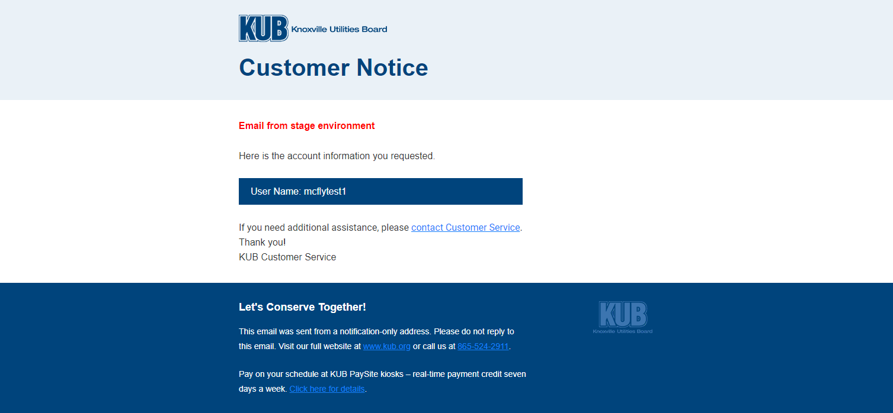
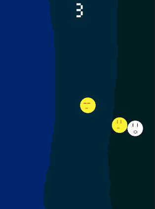
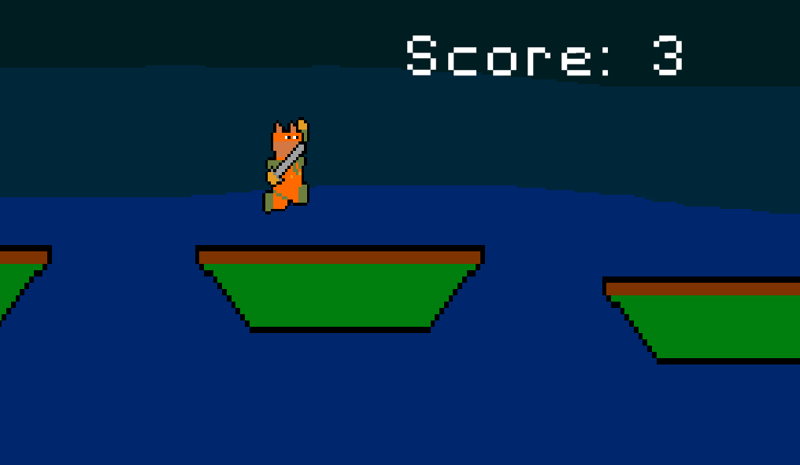

<!-- Main -->

<!-- One -->
<section id="one">
	

		<header class="major">
			<h1>Projects</h1>
		</header>

<!-- Content -->
<h2 id="content">Knoxville Utilities Board</h2>

The constantly evolving nature of web development is endlessly exciting. Every day
I get to wake up and be excited to go to work and learn new things. Over my first year and a half being
a developer I've worked on many projects for Knoxville Utilities Board.

	<!-- Break -->
	

		<h3>Automated Deployment Application</h3>
		
Using Ember.js and Mirage to simulate back end services, I built a responsive deployment application to allow for our deployments to be automated via a web application. I used Java web services calling Github's API via GraphQL to gather information about a given release's deployment data. Using this data I populated deployable list items that at a push of a button would allow deployment operators to deploy applications at a given release to the given application environment.

	
	

	<!-- Break -->
	

		<h3>Email Template Architecture</h3>
		
Using an fork of Sparkbox's <a href="https://github.com/sparkbox/email-lab" target="_blank">email lab</a> I built responsive email templates that I then used Handlebars replacement syntax a Java web service to unify all KUB automated e-mails through one web service. I then wrote a node script that our Jenkins CI could use to build a deployment artifact containing our built email templates in one file. This then was used to deploy releases of our email templates through our deployment application.

	

	

		
	

	<!-- Break -->
	

		<h3>Timesheet Application</h3>
		
I first designed an Oracle SQL staging table for timesheet entries. I then implemented Peoplecode and exposed SOAP service endpoints to allow for Java REST endpoints to expose timesheet data and allow KUB employees to enter timesheet data via our main apps landing page. I designed the application architecture to be built such that when an approver approves a timesheet entry, it is translated from the staging table to the final table in our HRIS system. This saves work for timekeepers and allows an approver to use a front facing interface to view times for all employees

	

<h2 id="content">Personal Projects</h2>

I've worked on a number of personal projects as I've gained experience as a developer. ABC: Always Be Coding is a principle I live by, and keeps my passion for development strong.

	<!-- Break -->
	

		<h3>Gradezilla</h3>
		
My wife was telling me about a few problems she had with the gradesheet application her school requires her to use, and it made me realize that a powerful free gradesheet application doesn't currently exist. I have begun development on the Ember side of a gradesheet application using an open source UI library called <a href="https://github.com/knoxville-utilities-board/ember-nrg-ui" target="_blank">ember-nrg-ui</a> developed at Knoxville Utilities Board. While I'm currently developing the front end <a href="https://github.com/MakMcFly/gradezilla" target="_blank">here</a> on Github, I plan to use Node services for the API layer and MongoDB or some alternative for the database layer.

	

	

		
	

	<!-- Break -->
	

		<h3>Wo Dude</h3>
		
<a href="https://github.com/MakMcFly/gravity-flyer" target="_blank">Wo Dude</a> was a game I created in a weekend. I wanted to challenge myself to come up with an idea and see if I could fully flesh it out within that time frame including the programming, art, and music. It was a fun project and it taught me a lot about the Godot game engine. Godot is an open source game engine built around modular design and has become my favorite engine for game programming.

	

	

		
	

	<!-- Break -->	
	

		<h3>Sword Runner</h3>
		
The first game I used to learn Gamemaker was Sword Runner. It's a side scrolling platformer that if I decide to finish will be redone in Godot. GML, or Gamemaker Language, is very similar to Javascript, which is a benefit to the engine. However, Godot is more easily flexible for creators who are comfortable with Object Oriented Programming techniques. It was a fun project to work on however as it taught me the basics of the engine.

	

	

		
	

</section>

